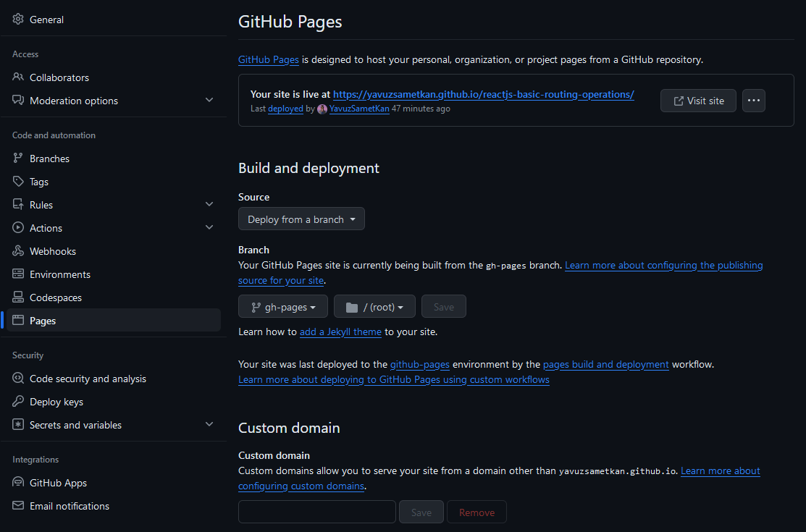

# React-App'i GitHub'a Deploy'lama
### Deploy Nedir?
"Deploy", bir yazılım uygulamasının veya web sitesinin, geliştirme sürecinden sonra yayına alınması veya sunuculara kurulması anlamına gelir. Bir uygulamanın veya web sitesinin deploy edilmesi, kullanıcıların gerçek dünya ortamında erişebilmesini sağlar.

Biz de bu repo ile oluşturduğumuz react uygulamalarımızı nasıl canlıya alıp kullanıcılara bir demo sayfası sunabileceğimizi öğreneceğiz.

### Başlayalım
1. Terminal'i açın.
2. React-app'inizin bulunduğu dizine gidin.
    ```
   cd my-react-app
   ```
3. React-app'inize paket yöneticiniz ile `gh-pages` paketini `devDependency` olarak kurun.
    ```
   npm i gh-pages --save-dev
   ```
4. GitHub'da bir repo oluşturun. Bu repoya react-app'imizi atacağız.
5. Oluşturduğunuz repo'ya react-app'inizi atın.
    
    Git-Bash ile atabilirsiniz;
    ```
    git init // git dosyası yoksa initialize et.
    git add . // değişiklikleri kaydet
    git commit -m 'commit-message' // değişiklikleri commit'le
    git brach -M main // main branch'ine geç
    git remote add origin https://github.com/githubKullanıcıAdı/repoAdı.git // Repo'yu eşle
    git push -u origin main // Projeyi gönder
    git push -u origin main --force // Eğer bir üstteki komut hata verirse kullan
    ```
6. Projenin `package.json` dosyasına girin ve aşağıdaki eklemeleri yapın.
    ```
   "homepage": "https://githubKullanıcıAdı.github.io/repoAdı/",
   ```
   `scripts` objesine şunları ekle; 
   ```
   "predeploy": "npm run build",
   "deploy": "gh-pages -d build"
   ```
7. Terminal'i tekrar açın ve aşağıdaki kodu yazın.
    ```
    npm start deploy
    ```
8. GitHub repo'nuzun ana sayfasından `Settings` > `Pages` kısmına gidin.
    <br/><br/>
    
9. En üst kısımda; "Your site is live at [https://githubKullanıcıAdı.github.io/repoAdı/]()" mesajı görünüyorsa işlem başarılı demektir.
10. Başardınız! <br/> Artık [https://githubKullanıcıAdı.github.io/repoAdı/]() bu url ile insanların projenizin Live Demo'sunu ziyaret etmelerini sağlayabilirsiniz.

